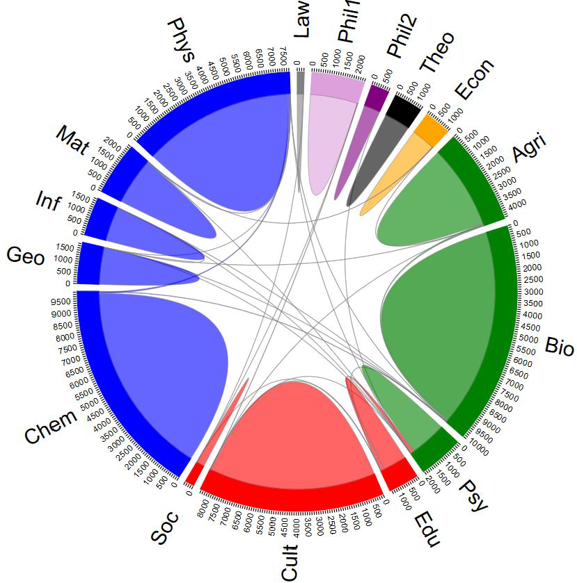

[](http://quantlet.de/index.php?p=info)

## [](http://quantlet.de/) **DMFchord** [](http://quantlet.de/d3/ia)


```yaml

Name of QuantLet : DMFchord

Published in : DMF - Drittmittelforschung

Description: 'Plots a chord-diagram of the number of co-authorships by researchers aggregated w.r.t. HU-Units'

Keywords : 'plot, chord, adjacency matrix, dependence, visualization, data visualization, analysis, discriptive methods, graphical representation, discriptive, descriptive-statistics'

See also : 'DMFsankey, DMFvarx, DMFtsmtpe'

Author : Alona Zharova

Submitted : Sat, Jan 06 2018 by Marius Sterling, Alona Zharova

Datafile : 'DMFchord.csv - The data set contains the adjacency matrix'

Input: a (n x n)-matrix with the number of co-authorships, additionally a matrix specifying the colors

Output: 'Boxplots for age and ranking scores of HB, RP and GS for Top-458 scientists within each ranking system for December 2015. The red lines denote the median, whereas the dotted lines introduce the mean.'
```





```r


# Close windows and clear variables
graphics.off()
rm(list = ls(all = TRUE))

# installing the chorddiag-package from github and laoding it
devtools::install_github("mattflor/chorddiag")
library(chorddiag)

# loading data
tab = NULL
tab$data = as.matrix(read.csv("DMFchord.csv"))
tab$color = read.csv("DMFchordCol.csv")

# plot of all co-authorships
chorddiag(
  tab$data, 
  groupnamePadding = 40,
  groupnameFontsize = 25,
  showTicks = T,
  groupColors = tab$color$color
)

# plot without co-authorships within HU-Units
chorddiag(
  tab$data-diag(diag(tab$data)), 
  groupnamePadding = 40,
  groupnameFontsize = 25,
  groupColors = tab$color$color
)
        
```
