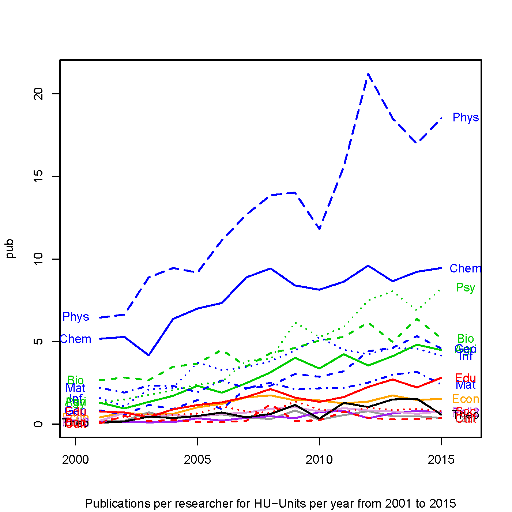
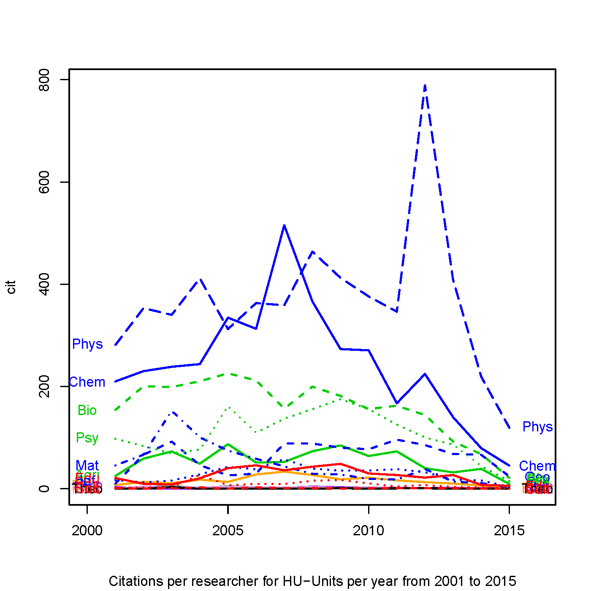

[](http://quantlet.de/index.php?p=info)

## [](http://quantlet.de/) **DMFpubProPubVol** [](http://quantlet.de/d3/ia)


```yaml

Name of QuantLet : DMFpubProPubVol

Published in : DMF - Drittmittelforschung

Description: 'Plots a time series plot, where each line represents the mean citations or publications of researchers per university Unit and year.'

Keywords : 'plot, line, line plot, time series, visualization, data visualization, analysis, discriptive methods, graphical representation, discriptive, descriptive-statistics'

See also : 'DMFsankey, DMFchord, DMFtsmtpe'

Author : Alona Zharova

Submitted : Sat, Jan 06 2018 by Marius Sterling, Alona Zharova

Datafile : 'DMFpubProPubVol_cit.csv and DMFpubProPubVol_pub.csv'

Input: 'Rdata files containing a list where elements represent the time series for a university Unit'

Output: 'Time series plot'
```






```r


# Close windows and clear variables
graphics.off()
rm(list = ls(all = TRUE))

# Install packages / Load library
libraries = c("stats")
lapply(libraries, function(x)
  if (!(x %in% installed.packages())) {
    install.packages(x)
  })
lapply(libraries, library, quietly = TRUE, character.only = TRUE)


# loading Legend File
load("huLeg.Rdata")

for (nam in c("cit","pub")) {
  # loading data
  load(paste0("DMFpubProPubVol_",nam,".Rdata"))
  # plotting pdf
  pdf(
    file = paste0("DMFpubPropubVol_",nam,"_relToResearch.pdf"),
    width = 7,height = 7
  )
  print({
    start = 2001
    plot(
      c(0,0),type = "n",
      xlim = c(start - 1,2016),
      ylim = range(tabPlot_rel2, na.rm = T),
      ylab = nam,
      xlab = NA,
      sub = paste0(
        ifelse(nam == "pub","Publications","Citations"),
        " per researcher for HU-Units per year from 2001 to 2015"
      )
    )
    for (hu in unique(names(tabPlot_rel2))) {
      lines(
        x = seq(start,2015),y = tabPlot_rel2[[hu]],
        col = huLeg[which(huLeg[,7] == hu)[1],"color"],
        lty = huLeg[which(huLeg[,7] == hu)[1],"lty"],
        lwd = 2
      )
      text(
        x = 2016,
        y = tabPlot_rel2[[hu]][paste0("scopus_",nam,"_2015")],
        labels = hu,
        col = huLeg[which(huLeg[,7] == hu)[1],"color"]
      )
      text(
        x = start - 1,
        y = tabPlot_rel2[[hu]][paste0("scopus_",nam,"_",start)],
        labels = hu,
        col = huLeg[which(huLeg[,7] == hu)[1],"color"]
      )
    }
  })
  dev.off()
}
        
```
