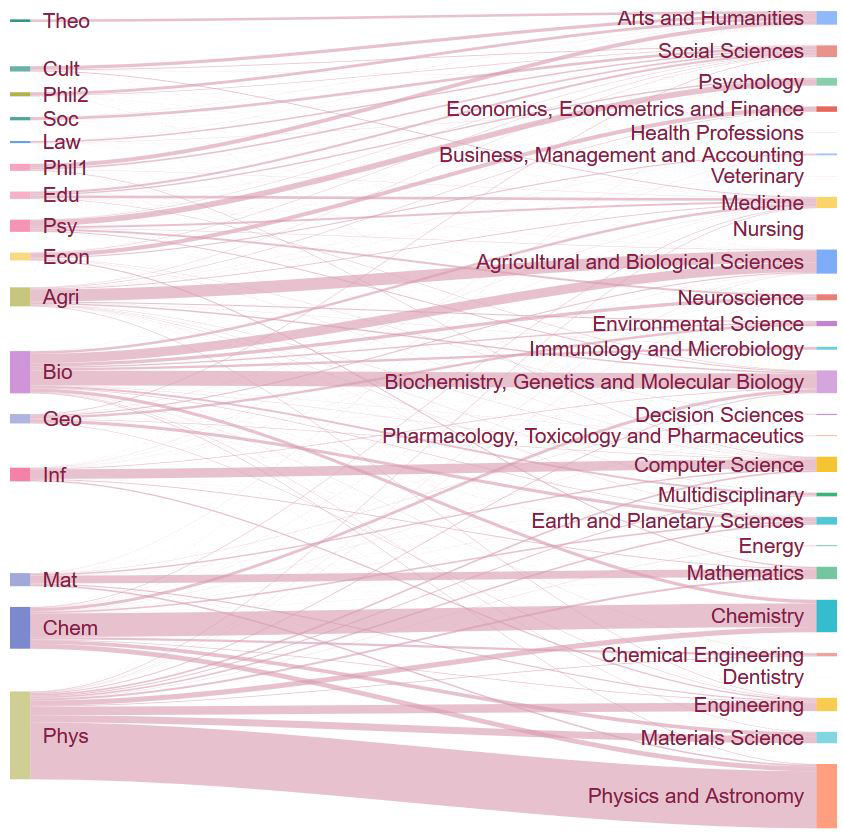

[](http://quantlet.de/index.php?p=info)

## [](http://quantlet.de/) **DMFsankey** [](http://quantlet.de/d3/ia)


```yaml

Name of QuantLet : DMFsankey

Published in : DMF - Drittmittelforschung

Description: 'Plots a sankey-plot of publications published in research fields'

Keywords : 'plot, sankey, connections, dependence, visualization, data visualization, analysis, discriptive methods, graphical representation, discriptive, descriptive-statistics'

See also : 'DMFsankey, DMFtsmtpe, DMFpubProPubVol'

Author : Alona Zharova

Submitted : Sat, Jan 06 2018 by Marius Sterling, Alona Zharova

Datafile : 'DMFsankey.csv - The data set contains a frequency table'

Input: 'a csv containing 3 columns - left and right side node and frequency (in this order)'

Output: 'Sankey plot'
```




```r


# Close windows and clear variables
graphics.off()
rm(list = ls())

# Install packages / Load library
libraries = c("googleVis")
lapply(libraries, function(x)
  if (!(x %in% installed.packages())) {
    install.packages(x)
  })
lapply(libraries, library, quietly = TRUE, character.only = TRUE)

# load data
data = read.csv("DMFsankey.csv")

# sankey-plot
sankey = gvisSankey(
  data,
  options = list(
    sankey = "{link: {color: { fill: '#d799ae' } },
              node: { color: { fill: '#a61d4c' },
              label: { color: '#871b47' } }}"
  )
)
plot(sankey)
        
```
