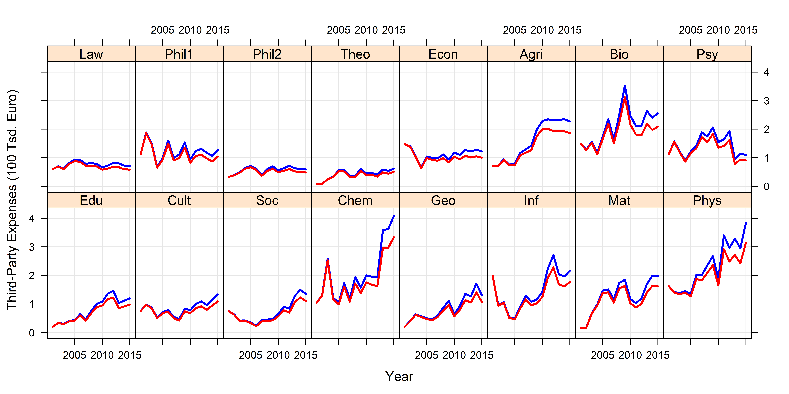

[](http://quantlet.de/index.php?p=info)

## [](http://quantlet.de/) **DMFtsmtpe** [](http://quantlet.de/d3/ia)


```yaml

Name of QuantLet : DMFtsmtpe

Published in : DMF - Drittmittelforschung

Description: 'Plots the TPE per researcher for each university Unit (also inflation adjusted)'

Keywords : 'plot, trellis, trellis graph, time series, visualization, data visualization, analysis, discriptive methods, graphical representation, discriptive, descriptive-statistics'

See also : 'DMFchord, DMFsankey, DMFpubProPubVol'

Author : Alona Zharova

Submitted : Sat, Jan 06 2018 by Marius Sterling, Alona Zharova

Datafile : 'DMFtsmtpe.csv'

Input: '2 files of same size with each 4 columns (year, Unit, Expenses, Expenses relative to number of researcher)'

Output: 'Trellis graph of time series plots'
```




```r


# Close windows and clear variables
graphics.off()
rm(list = ls(all = TRUE))

# Install packages / Load library
libraries = c("lattice", "latticeExtra")
lapply(libraries, function(x) if (!(x %in% installed.packages())) {install.packages(x)})
lapply(libraries, library, quietly = TRUE, character.only = TRUE)

# loading data
D = read.csv("DMFtsmtpe.csv")
D_adj = read.csv("DMFtsmtpe_adj.csv")
ord = c(6,4,15,3,7,8,10,13,9,11,12,16,5,1,2,14)

# inflation unadjusted 
plot_D2 = xyplot(
  ExpensesRelRes / 10 ^ 5 ~ Year | factor(Faculty), D,
  type = c("g", "l"),
  col = 'blue',
  layout = c(length(unique(ord)) / 2,2),
  ylab = "Third-Party Expenses (100 Tsd. Euro)",
  auto.key = list(
    lines = TRUE, points = FALSE, columns = 2
  ),
  lwd = 2.5,
  index.cond = list(ord)
)

# inflation adjusted
plot_D_adj2 = xyplot(
  ExpensesRelRes / 10 ^ 5 ~ Year | factor(Faculty), D_adj,
  type = c("l"),
  col = 'red',
  layout = c(length(unique(ord)) / 2,2),
  ylab = "Third-Party Expenses (100 Tsd. Euro)",
  auto.key = list(
    lines = TRUE, points = FALSE, columns = 2
  ),
  lwd = 2.5,
  index.cond = list(ord)
)

# extracting picture
png(
  file = paste0("DMFtsmtpe_relRes_with_adj.png"),
  width = 10, height = 5, units = "in", res = 900
)
plot_D2 + plot_D_adj2
dev.off()
        
```
